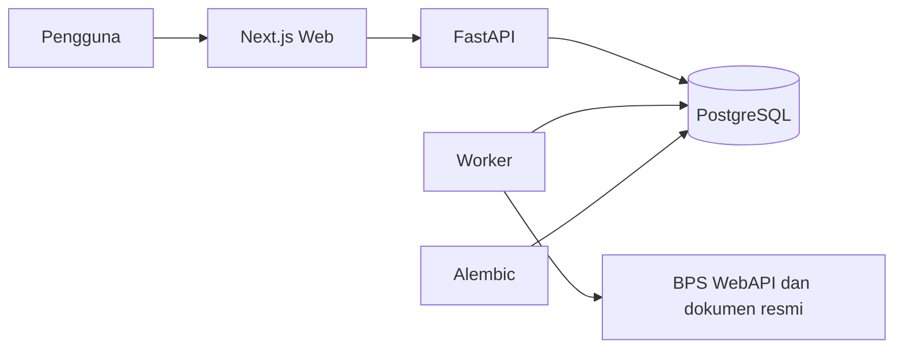

<div align="center">

# NusaIntel

### Intelijen data publik Indonesia yang transparan dan mudah dipahami

NusaIntel membantu pengguna memeriksa kualitas data, membandingkan peluang antarwilayah,
menemukan kemiripan regional, dan menelusuri regulasi langsung dari sumber resminya.

[](https://github.com/LaboNapitupulu/NusaIntel/actions/workflows/ci.yml)
[](LICENSE)
[](https://github.com/LaboNapitupulu/NusaIntel)
[](compose.yaml)

[Mulai cepat](#mulai-cepat) · [Fitur](#fitur-utama) · [Teknologi](#teknologi-yang-digunakan) · [Dokumentasi](#dokumentasi) · [Kontribusi](#pengembangan-dan-kontribusi)

</div>

---

## Tentang NusaIntel

Data publik sering tersebar, sulit dibandingkan, dan tidak selalu mudah ditelusuri kembali
ke sumbernya. NusaIntel menyatukan data statistik dan regulasi Indonesia ke dalam pengalaman
yang lebih ramah bagi pengguna, tanpa menyembunyikan kualitas, sumber, maupun keterbatasannya.

Platform ini berfokus pada empat area:

| Produk | Kegunaan |
|---|---|
| **Pusat Kualitas Data** | Memeriksa keterbaruan, kelengkapan, konsistensi, dan kendala data. |
| **Peluang Regional** | Membandingkan 2–5 provinsi dengan indikator dan bobot yang dapat diatur. |
| **Analisis Wilayah** | Menemukan wilayah serupa, kelompok regional, dan faktor pembandingnya. |
| **RegulasiLens ID** | Menjawab pertanyaan regulasi dengan kutipan dan tautan dokumen resmi. |

> NusaIntel adalah alat eksplorasi data dan regulasi. Hasil analisis bukan fakta objektif,
> rekomendasi investasi, atau nasihat hukum.

## Tampilan aplikasi

<div align="center">
  
  <br />
  <sub>Peluang Regional — skenario, peringkat, dan kontribusi indikator dalam satu tampilan.</sub>
</div>

<br />

<details>
<summary><strong>Lihat tampilan lainnya</strong></summary>

### Pusat Kualitas Data


### Analisis Wilayah pada perangkat seluler


</details>

## Fitur utama

- **Data statistik BPS terintegrasi** — TPT, TPAK, kemiskinan, PDRB per kapita,
  pertumbuhan PDRB, dan IPM tingkat provinsi.
- **Kualitas data yang terlihat** — status kesehatan, keterbaruan, pemeriksaan kualitas,
  kendala aktif, dan versi terakhir yang dapat digunakan.
- **Skenario perbandingan fleksibel** — pemilihan wilayah, indikator, tahun, arah penilaian,
  bobot, normalisasi, dan ambang kelengkapan.
- **Analisis regional yang dapat dijelaskan** — kemiripan wilayah, faktor pendorong,
  kelompok regional, peta skematis, tabel aksesibel, unduhan JSON, dan tampilan cetak.
- **Pencarian regulasi bersumber** — pencarian gabungan, jawaban ekstraktif, kutipan,
  konteks pasal, status dokumen, dan perbandingan versi.
- **Antarmuka responsif** — halaman terpisah, tema terang/gelap, transisi halus,
  navigasi seluler, serta dukungan reduced motion.
- **Siap dijalankan dengan Docker** — web, API, worker, migrasi, dan PostgreSQL dalam
  satu konfigurasi Compose.

## Teknologi yang digunakan

### Bahasa pemrograman

<p>
  
  
  
  
  
</p>

### Framework dan library

| Area | Teknologi | Peran |
|---|---|---|
| Frontend | **Next.js 16**, **React 19** | App Router, rendering, routing, dan UI interaktif. |
| Bahasa frontend | **TypeScript 5.9** | Kontrak tipe dan pengembangan frontend yang aman. |
| Backend | **FastAPI**, **Uvicorn** | REST API asinkron dan server aplikasi. |
| Validasi & konfigurasi | **Pydantic Settings** | Validasi konfigurasi dan environment aplikasi. |
| Database | **PostgreSQL 17**, **SQLAlchemy 2**, **asyncpg** | Penyimpanan relasional dan akses database asinkron. |
| Migrasi | **Alembic** | Perubahan skema database yang terlacak. |
| Integrasi data | **HTTPX** | Pengambilan data dari layanan eksternal. |
| Dokumen regulasi | **pypdf** | Ekstraksi dokumen PDF resmi. |
| Observabilitas | **structlog** | Log aplikasi terstruktur. |

### Tools pengembangan dan kualitas

| Kategori | Tools |
|---|---|
| Container & deployment | Docker, Docker Compose, Caddy |
| Frontend testing | Vitest, Testing Library, Playwright, axe-core |
| Backend testing | Pytest, pytest-asyncio, Coverage.py |
| Lint & type checking | ESLint, TypeScript, Ruff, mypy |
| Keamanan | Gitleaks, pip-audit, npm audit |
| CI/CD | GitHub Actions |

## Arsitektur ringkas



| Komponen | Tanggung jawab |
|---|---|
| `web` | Antarmuka dan pengalaman pengguna berbasis Next.js. |
| `api` | Data, analisis peluang, analisis regional, dan pencarian regulasi. |
| `worker` | Pengambilan serta pemrosesan data terjadwal. |
| `migrate` | Menyiapkan dan memperbarui skema database. |
| `db` | Penyimpanan PostgreSQL persisten. |

## Mulai cepat

### Prasyarat

- Git
- Docker Desktop dengan Docker Compose
- BPS WebAPI key untuk mengambil data BPS secara langsung

### 1. Clone repository

```powershell
git clone https://github.com/LaboNapitupulu/NusaIntel.git
cd NusaIntel
```

### 2. Siapkan konfigurasi

```powershell
Copy-Item .env.example .env
powershell -ExecutionPolicy Bypass -File .\scripts\configure_bps_key.ps1
```

Script akan menyimpan BPS API key ke `.env` tanpa menampilkannya kembali. File tersebut
telah diabaikan oleh Git.

### 3. Jalankan seluruh aplikasi

```powershell
docker compose up -d --build
```

### 4. Buka aplikasi

| Layanan | URL |
|---|---|
| Web NusaIntel | <http://localhost:3100> |
| Dokumentasi API | <http://localhost:8000/api/docs> |
| Status API | <http://localhost:8000/api/v1/health> |

Periksa status container:

```powershell
docker compose ps
```

Hentikan layanan tanpa menghapus database:

```powershell
docker compose down
```

> Gunakan `docker compose down --volumes` hanya ketika Anda memang ingin menghapus
> seluruh database lokal dan memulai dari awal.

## Mengisi data

Jalankan seluruh indikator BPS:

```powershell
.\scripts\run_bps_pipeline.ps1
```

Untuk mencoba alur TPT tanpa mengambil data langsung dari BPS:

```powershell
.\scripts\run_tpt_pipeline.ps1 -Fixture
```

Setelah data tersedia, buka:

- [Pusat Kualitas Data](http://localhost:3100/control-tower)
- [Peluang Regional](http://localhost:3100/opportunity)
- [Analisis Wilayah](http://localhost:3100/regional-analytics)
- [RegulasiLens ID](http://localhost:3100/regulations)

## Pengembangan dan kontribusi

Pengembangan tanpa Docker membutuhkan **Python 3.11+** dan **Node.js 20.9+**
(CI menggunakan Python 3.13 dan Node.js 24).

### Backend

```powershell
cd backend
python -m venv .venv
.\.venv\Scripts\python.exe -m pip install -e ".[dev]"
.\.venv\Scripts\python.exe -m uvicorn app.main:app --reload
```

Pemeriksaan backend:

```powershell
.\.venv\Scripts\python.exe -m ruff check app tests migrations
.\.venv\Scripts\python.exe -m ruff format --check app tests migrations
.\.venv\Scripts\python.exe -m mypy app
.\.venv\Scripts\python.exe -m pytest
.\.venv\Scripts\alembic.exe upgrade head
```

### Frontend

```powershell
cd frontend
npm ci
npm run dev
```

Pemeriksaan frontend:

```powershell
npm run lint
npm run typecheck
npm test
npm run test:e2e
npm run build
```

### Verifikasi proyek

```powershell
.\scripts\verify_phase1.ps1
.\scripts\verify_release.ps1
```

Gunakan `-SkipDocker` untuk verifikasi statis, atau `-FullStack` pada
`verify_release.ps1` untuk menyertakan seluruh layanan Compose.

## Struktur repository

```text
nusa-intel/
├── backend/                  FastAPI, worker, model, migrasi, dan pengujian
├── contracts/                Kontrak data portabel dan aturan versinya
├── frontend/                 Aplikasi Next.js dan pengujian antarmuka
├── regulations/              Manifest dan evaluasi dokumen regulasi
├── docs/                     PRD teknis, arsitektur, metodologi, dan runbook
├── scripts/                  Otomasi konfigurasi, pipeline, dan verifikasi
├── tests/                    Fixture lintas komponen
├── compose.yaml              Stack pengembangan lokal
├── compose.production.yaml   Kandidat deployment produksi
├── PRD.md                    Sasaran dan ruang lingkup produk
└── IMPLEMENTATION_PLAN.md    Fase, tolok ukur, dan target implementasi
```

## Dokumentasi

| Dokumen | Isi |
|---|---|
| [PRD](PRD.md) | Visi, pengguna, kebutuhan, ruang lingkup, dan tolok ukur produk. |
| [Implementation Plan](IMPLEMENTATION_PLAN.md) | Fase pengerjaan, target, dan kriteria selesai. |
| [Architecture](docs/architecture.md) | Arsitektur aplikasi dan keputusan teknis utama. |
| [Data Dictionary](docs/data-dictionary.md) | Definisi dataset dan field penting. |
| [Methodology](docs/methodology.md) | Metode penilaian Peluang Regional. |
| [Regional Analytics](docs/regional-analytics-methodology.md) | Metode kemiripan dan pengelompokan wilayah. |
| [Runbook](docs/runbook.md) | Operasional, pemulihan, dan troubleshooting. |
| [Privacy & Security](docs/privacy-and-security.md) | Batasan data, privasi, dan kontrol keamanan. |
| [Public Beta Deployment](docs/public-beta-deployment.md) | Persiapan deployment publik. |

## Konfigurasi penting

| Variabel | Wajib | Kegunaan |
|---|---|---|
| `BPS_API_KEY` | Untuk data langsung | Token BPS WebAPI; hanya digunakan backend/worker. |
| `DATABASE_URL` | Produksi | URL PostgreSQL untuk SQLAlchemy asinkron. |
| `NEXT_PUBLIC_API_BASE_URL` | Tidak | Alamat API yang diakses browser. |
| `WEB_PORT` | Tidak | Port web lokal; default `3100`. |
| `API_PORT` | Tidak | Port API lokal; default `8000`. |
| `BPS_SCHEDULE_ENABLED` | Tidak | Mengaktifkan pengambilan data terjadwal. |
| `BPS_SCHEDULE_INTERVAL_SECONDS` | Jika terjadwal | Interval pengambilan data; default satu hari. |

Daftar lengkap tersedia di [`.env.example`](.env.example) dan
[`docs/public-beta-deployment.md`](docs/public-beta-deployment.md). Jangan pernah memasukkan
secret asli ke dalam Git.

## Sumber data dan batasan

- Data statistik berasal dari **BPS WebAPI** dan tetap mengikuti atribusi serta ketentuan BPS.
- Dokumen RegulasiLens berasal dari sumber resmi **JDIH BPK** yang dicatat dalam manifest.
- Peta regional bersifat skematis dan bukan batas administratif resmi.
- RegulasiLens membantu penelusuran dokumen dan bukan pengganti nasihat hukum profesional.

Detail sumber dan lisensi tersedia di [`docs/source-inventory.md`](docs/source-inventory.md).

## Lisensi

Kode sumber NusaIntel dirilis menggunakan [MIT License](LICENSE).

---

<div align="center">

**Dibangun untuk membuat data publik Indonesia lebih mudah diperiksa, dibandingkan, dan dipahami.**

</div>
