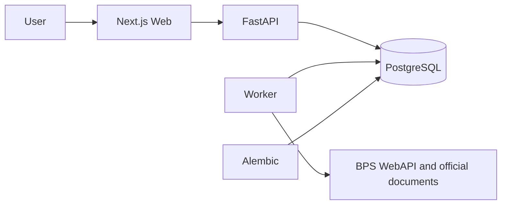

<div align="center">

# NusaIntel

### Transparent, evidence-driven intelligence for Indonesian public data

NusaIntel helps users assess data quality, compare regional opportunities,
identify similar provinces, and explore regulations through verifiable official sources.

[](https://github.com/LaboNapitupulu/NusaIntel/actions/workflows/ci.yml)
[](LICENSE)
[](https://github.com/LaboNapitupulu/NusaIntel)
[](compose.yaml)

[Quick start](#quick-start) · [Features](#key-features) · [Technology](#technology-stack) · [Documentation](#documentation) · [Development](#development-and-validation)

</div>

---

## Overview

Public data is often fragmented, difficult to compare, and hard to trace back to its source.
NusaIntel brings Indonesian statistics and regulations into one accessible product while
keeping data quality, provenance, methodology, and limitations visible.

The platform is organized into four product areas:

| Product | Purpose |
|---|---|
| **Data Quality Center** | Review data freshness, completeness, consistency, and active issues. |
| **Regional Opportunity** | Compare 2–5 provinces using configurable indicators and weights. |
| **Regional Analytics** | Discover similar regions, regional groups, and their differentiating factors. |
| **RegulasiLens ID** | Explore regulations with quotations and links to official documents. |

> NusaIntel is an exploration tool for public data and regulations. Its outputs are not
> objective facts, investment recommendations, or legal advice.

## Product preview

<div align="center">
  
  <br />
  <sub>Regional Opportunity — scenario configuration, ranking, and indicator contributions.</sub>
</div>

<br />

<details>
<summary><strong>View additional screens</strong></summary>

### Data Quality Center


### Regional Analytics on mobile


</details>

## Key features

- **Integrated BPS statistics** — provincial unemployment, labor-force participation,
  poverty, GDP per capita, GDP growth, and Human Development Index data.
- **Visible data quality** — health status, freshness, quality checks, active issues,
  and the latest usable dataset version.
- **Configurable comparison scenarios** — choose regions, indicators, year, scoring
  direction, weights, normalization method, and minimum coverage.
- **Explainable regional analytics** — similarity results, contributing factors,
  regional groups, a schematic map, an accessible table, JSON export, and print layout.
- **Source-grounded regulation search** — hybrid retrieval, extractive answers,
  citations, surrounding context, document status, and version comparison.
- **Responsive interface** — dedicated product pages, light and dark themes, smooth
  transitions, mobile navigation, and reduced-motion support.
- **Docker-based local environment** — web, API, worker, migrations, and PostgreSQL
  are orchestrated through a single Compose configuration.

## Technology stack

### Programming languages

<p>
  
  
  
  
  
</p>

### Frameworks and libraries

| Area | Technology | Role |
|---|---|---|
| Frontend | **Next.js 16**, **React 19** | App Router, rendering, routing, and interactive UI. |
| Frontend language | **TypeScript 5.9** | Static typing and reliable frontend contracts. |
| Backend | **FastAPI**, **Uvicorn** | Asynchronous REST API and application server. |
| Validation & configuration | **Pydantic Settings** | Runtime configuration and environment validation. |
| Database | **PostgreSQL 17**, **SQLAlchemy 2**, **asyncpg** | Relational persistence and asynchronous data access. |
| Migrations | **Alembic** | Version-controlled database schema changes. |
| Data integration | **HTTPX** | Asynchronous access to external data services. |
| Regulation documents | **pypdf** | Extraction of official PDF documents. |
| Observability | **structlog**, bounded runtime metrics | Structured logs, release identity, uptime, request/error counts, and latency diagnostics. |

### Development and quality tools

| Category | Tools |
|---|---|
| Containers & deployment | Docker, Docker Compose, Caddy |
| Frontend testing | Vitest, Testing Library, Playwright, axe-core |
| Backend testing | Pytest, pytest-asyncio, Coverage.py |
| Linting & type checking | ESLint, TypeScript, Ruff, mypy |
| Security | Gitleaks, pip-audit, npm audit |
| Continuous integration | GitHub Actions |

## Architecture at a glance



| Component | Responsibility |
|---|---|
| `web` | Next.js interface and user experience. |
| `api` | Data access, opportunity scoring, regional analytics, and regulation search. |
| `worker` | Scheduled data retrieval and processing. |
| `migrate` | Database initialization and schema upgrades. |
| `db` | Persistent PostgreSQL storage. |

## Quick start

### Prerequisites

- Git
- Docker Desktop with Docker Compose
- A BPS WebAPI key for live BPS ingestion

### 1. Clone the repository

```powershell
git clone https://github.com/LaboNapitupulu/NusaIntel.git
cd NusaIntel
```

### 2. Configure the environment

```powershell
Copy-Item .env.example .env
powershell -ExecutionPolicy Bypass -File .\scripts\configure_bps_key.ps1
```

The script stores the BPS API key in `.env` without printing it back to the terminal.
The file is excluded from Git.

### 3. Start the full application

```powershell
docker compose up -d --build
```

### 4. Open the services

| Service | URL |
|---|---|
| NusaIntel web application | <http://localhost:3100> |
| Interactive API documentation | <http://localhost:8000/api/docs> |
| API health endpoint | <http://localhost:8000/api/v1/health> |

Check container status:

```powershell
docker compose ps
```

Stop the services without deleting the database:

```powershell
docker compose down
```

> Run `docker compose down --volumes` only when you intentionally want to delete the
> local database and start from a clean state.

## Loading data

Run all contracted BPS indicators:

```powershell
.\scripts\run_bps_pipeline.ps1
```

Run the unemployment pipeline against the checked-in fixture without contacting BPS:

```powershell
.\scripts\run_tpt_pipeline.ps1 -Fixture
```

Once data is available, explore:

- [Data Quality Center](http://localhost:3100/control-tower)
- [Regional Opportunity](http://localhost:3100/opportunity)
- [Regional Analytics](http://localhost:3100/regional-analytics)
- [RegulasiLens ID](http://localhost:3100/regulations)

## Development and validation

Local development without Docker requires **Python 3.11+** and **Node.js 20.9+**.
CI currently runs on Python 3.13 and Node.js 24.

### Backend

```powershell
cd backend
python -m venv .venv
.\.venv\Scripts\python.exe -m pip install -e ".[dev]"
.\.venv\Scripts\python.exe -m uvicorn app.main:app --reload
```

Backend quality gates:

```powershell
.\.venv\Scripts\python.exe -m ruff check app tests migrations
.\.venv\Scripts\python.exe -m ruff format --check app tests migrations
.\.venv\Scripts\python.exe -m mypy app
.\.venv\Scripts\python.exe -m pytest
.\.venv\Scripts\alembic.exe upgrade head
```

### Frontend

```powershell
cd frontend
npm ci
npm run dev
```

Frontend quality gates:

```powershell
npm run lint
npm run typecheck
npm test
npm run test:e2e
npm run build
```

### Full-project verification

```powershell
.\scripts\verify_phase1.ps1
.\scripts\verify_release.ps1
```

Use `-SkipDocker` for static checks only, or pass `-FullStack` to
`verify_release.ps1` to include every Compose service.

## Repository structure

```text
nusa-intel/
├── backend/                  FastAPI, worker, models, migrations, and tests
├── contracts/                Portable data contracts and versioning rules
├── frontend/                 Next.js application and interface tests
├── regulations/              Regulation manifests and evaluation suites
├── docs/                     Architecture, methodology, operations, and evidence
├── scripts/                  Configuration, pipeline, and verification automation
├── tests/                    Cross-project fixtures
├── compose.yaml              Local development stack
├── compose.production.yaml   Production deployment candidate
├── PRD.md                    Product scope, requirements, and success criteria
└── IMPLEMENTATION_PLAN.md    Delivery phases, benchmarks, and implementation goals
```

## Documentation

| Document | Contents |
|---|---|
| [Product Requirements](PRD.md) | Product vision, users, requirements, scope, and success criteria. |
| [Implementation Plan](IMPLEMENTATION_PLAN.md) | Delivery phases, goals, benchmarks, and completion criteria. |
| [Architecture](docs/architecture.md) | Application architecture and key technical decisions. |
| [Data Dictionary](docs/data-dictionary.md) | Dataset and field definitions. |
| [Opportunity Methodology](docs/methodology.md) | Regional Opportunity scoring methodology. |
| [Regional Analytics Methodology](docs/regional-analytics-methodology.md) | Regional similarity and clustering methods. |
| [Operations Runbook](docs/runbook.md) | Operations, recovery, and troubleshooting procedures. |
| [Privacy & Security](docs/privacy-and-security.md) | Data boundaries, privacy, and security controls. |
| [Public Beta Deployment](docs/public-beta-deployment.md) | Public deployment requirements and safeguards. |

## Key configuration

| Variable | Required | Purpose |
|---|---|---|
| `BPS_API_KEY` | Live ingestion | BPS WebAPI token; available only to the backend and worker. |
| `RELEASE_SHA` | No | Release identifier exposed by local liveness and metrics endpoints. |
| `DATABASE_URL` | Production | Asynchronous SQLAlchemy PostgreSQL URL. |
| `NEXT_PUBLIC_API_BASE_URL` | No | API origin exposed to the browser. |
| `WEB_PORT` | No | Local web port; defaults to `3100`. |
| `API_PORT` | No | Local API port; defaults to `8000`. |
| `BPS_SCHEDULE_ENABLED` | No | Enables scheduled data ingestion. |
| `BPS_SCHEDULE_INTERVAL_SECONDS` | Scheduled ingestion | Retrieval interval; defaults to one day. |

The complete field list is available in [`.env.example`](.env.example) and
[`docs/public-beta-deployment.md`](docs/public-beta-deployment.md). Never commit real
credentials or production secrets.

## Data sources and limitations

- Statistical data is obtained through the **BPS WebAPI** and remains subject to BPS
  attribution requirements and terms of use.
- RegulasiLens documents are sourced from official **JDIH BPK** pages recorded in the manifest.
- The regional map is schematic and does not represent official administrative boundaries.
- RegulasiLens supports document exploration and is not a substitute for professional legal advice.

See [`docs/source-inventory.md`](docs/source-inventory.md) for source and licensing details.

## License

NusaIntel is released under the [MIT License](LICENSE).

---

<div align="center">

**Built to make Indonesian public data easier to verify, compare, and understand.**

</div>
