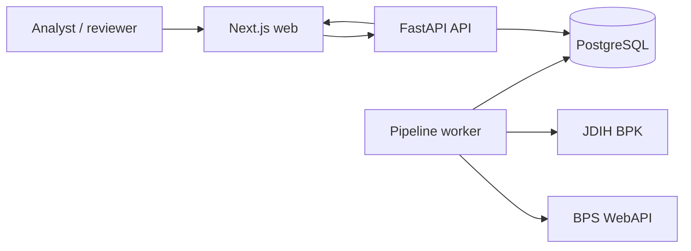
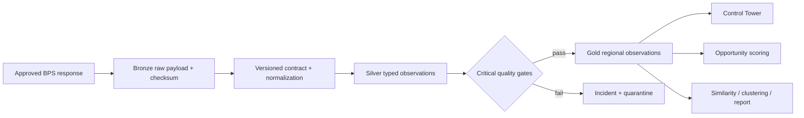

# NusaIntel architecture

- Status: Phase 6 release baseline
- Updated: 2026-08-11

## System context

NusaIntel is an evidence-first public-data system. The browser never receives the BPS API
key or direct database access. FastAPI owns validation and analysis, PostgreSQL owns
immutable publication state and operational evidence, and a separate worker owns scheduled
ingestion.

## Runtime containers

| Container | Responsibility | Trust boundary |
|---|---|---|
| `web` | Render dashboard, collect public scenario configuration, export public reports | Browser-visible configuration only |
| `api` | Strict request validation, catalog, Control Tower, scoring, similarity, clustering | No browser-supplied SQL or contract code |
| `worker` | Retrieve approved BPS endpoints and execute the governed pipeline | Sole runtime holder of `BPS_API_KEY` |
| `migrate` | Apply Alembic revisions before API/worker startup | One-shot schema mutation |
| `db` | Store operational metadata and Bronze/Silver/Gold evidence | Persistent state; not public |

Compose waits for PostgreSQL health, completes migrations, then starts API/worker; web waits
for API health. The frontend standalone image and backend image both run as minimal runtime
stages; the frontend runs as an unprivileged user.

The worker can run one configured indicator immediately and at a bounded interval. It is
off by default, requires a BPS key when enabled, and holds a PostgreSQL advisory lock across
fetch and publication so multiple worker replicas fail closed to `skipped_locked`.

## Governed data flow

Publication is immutable and idempotent by checksum. A failed candidate cannot replace the
last-known-good Gold version. Every quality result references its exact contract, pipeline
run, and dataset version; lineage connects every published downstream version to upstream
evidence.

## Application boundaries

- `app/bps`: conservative HTTP client, discovery, and approved source capture.
- `app/pipeline`: contracts, normalization, quality evaluation, idempotent publication.
- `app/control_tower`: dataset health, quality history, lineage, drift, and incidents.
- `app/opportunity`: comparable indicator context, normalization, scoring, sensitivity.
- `app/regional_analytics`: complete-case preprocessing, similarity, validated clustering,
  regional reports.
- `app/regulasilens`: approved-manifest ingestion, immutable legal-document storage,
  deterministic structural parsing, BM25/dense/hybrid retrieval with source-preserving
  reranking, evidence-only extractive answers, citation validation, structured version
  comparison, quality gates, and evidenced relation graph.
- `frontend/components`: client-side product surfaces consuming versioned API responses.

Core calculation modules are pure/deterministic and tested separately from SQL/service
adapters. Services translate immutable database state into those engines; API routes enforce
Pydantic schemas and map domain errors to stable HTTP responses.

## Security and failure model

- Secrets are server-side environment values and ignored by Git.
- CORS is allow-listed and credential-free for the public MVP.
- External payloads are size/retry bounded, checksummed, typed, and quarantined on failure.
- Missing analytical values remain null; no zero-fill or cross-period substitution occurs.
- Expensive analysis inputs have strict feature, seed, candidate, and result limits.
- Grounded-answer requests have bounded input/citations, a sub-10-second timeout, and an
  in-process concurrency semaphore; the deterministic baseline makes zero external model
  calls and reports that fact in provenance.
- Request IDs and structured logs support diagnosis without logging API keys.
- Database unavailability degrades health and product states instead of returning false
  success.

See `docs/privacy-and-security.md`, `docs/runbook.md`, and ADRs for operational and decision
detail.
