# Entity Relationship Diagram

- Status: Physical model through Phase 7
- Updated: 2026-08-16

```mermaid
erDiagram
    SOURCE ||--o{ DATASET : owns
    DATASET ||--o{ DATASET_VERSION : versions
    DATASET ||--o{ DATA_CONTRACT : governed_by
    DATASET ||--o{ QUALITY_EXCEPTION : permits
    DATASET ||--o{ INCIDENT : owns
    DATASET_VERSION ||--o{ PIPELINE_RUN : processed_by
    DATASET_VERSION ||--o{ QUALITY_CHECK_RESULT : evaluated_by
    DATASET_VERSION ||--o{ LINEAGE_EDGE : upstream
    DATASET_VERSION ||--o{ LINEAGE_EDGE : downstream
    PIPELINE_RUN ||--o{ QUALITY_CHECK_RESULT : produces
    PIPELINE_RUN ||--o{ INCIDENT : triggers
    DATA_CONTRACT ||--o{ QUALITY_CHECK_RESULT : evaluates_with
    DATA_CONTRACT ||--o{ SCHEMA_DRIFT_EVENT : detects_with
    QUALITY_EXCEPTION ||--o{ QUALITY_CHECK_RESULT : waives
    DATASET_VERSION ||--o{ SCHEMA_DRIFT_EVENT : exhibits
    REGION ||--o{ OBSERVATION : has
    INDICATOR ||--o{ OBSERVATION : measures
    DATASET_VERSION ||--o{ OBSERVATION : supplies
    DATASET_VERSION ||--o{ RAW_PAYLOAD : stores
    DATASET_VERSION ||--o{ QUARANTINE_RECORD : rejects
    DATASET_VERSION ||--o{ GOLD_REGIONAL_OBSERVATION : publishes
    DATASET_VERSION ||--o{ COVERAGE_SUMMARY : summarizes
    REGION ||--o{ GOLD_REGIONAL_OBSERVATION : has
    INDICATOR ||--o{ GOLD_REGIONAL_OBSERVATION : measures
    DATASET ||--|| REGULATION_DOCUMENT : governs
    DATASET_VERSION ||--o| RAW_REGULATION_DOCUMENT : stores
    REGULATION_DOCUMENT ||--o{ REGULATION_DOCUMENT_VERSION : versions
    REGULATION_DOCUMENT_VERSION ||--o{ REGULATION_SECTION : contains
    REGULATION_DOCUMENT ||--o{ REGULATION_RELATION : cites

    SOURCE {
        uuid id PK
        string code UK
        string name
        string base_url
        string owner
        string attribution
        timestamp created_at
    }

    DATASET {
        uuid id PK
        uuid source_id FK
        string code UK
        string name
        string layer
        string owner
        interval freshness_sla
        boolean active
    }

    DATASET_VERSION {
        uuid id PK
        uuid dataset_id FK
        string source_identity
        string checksum
        string code_commit
        timestamp source_reference_at
        timestamp retrieved_at
        timestamp processed_at
        integer row_count
        string status
    }

    PIPELINE_RUN {
        uuid id PK
        uuid dataset_version_id FK
        string run_type
        string status
        timestamp started_at
        timestamp finished_at
        string correlation_id
        string error_category
    }

    DATA_CONTRACT {
        uuid id PK
        uuid dataset_id FK
        integer version
        jsonb specification
        string checksum
        timestamp effective_at
    }

    QUALITY_CHECK_RESULT {
        uuid id PK
        uuid dataset_version_id FK
        uuid pipeline_run_id FK
        uuid data_contract_id FK
        uuid quality_exception_id FK
        string check_code
        string severity
        string status
        jsonb expected
        jsonb observed
        jsonb safe_sample
    }

    QUALITY_EXCEPTION {
        uuid id PK
        uuid dataset_id FK
        string check_code
        string reason
        string owner
        timestamp expires_at
        boolean active
    }

    SCHEMA_DRIFT_EVENT {
        uuid id PK
        uuid dataset_version_id FK
        uuid data_contract_id FK
        string change_type
        string column_name
        jsonb expected
        jsonb observed
    }

    INCIDENT {
        uuid id PK
        uuid dataset_id FK
        uuid pipeline_run_id FK
        string check_code
        string severity
        string status
        string title
        string resolution_note
        timestamp resolved_at
    }

    LINEAGE_EDGE {
        uuid id PK
        uuid upstream_version_id FK
        uuid downstream_version_id FK
        string transformation_version
        string run_id
    }

    REGION {
        string code PK
        string name
        string level
        string parent_code
        date valid_from
        date valid_to
    }

    INDICATOR {
        string code PK
        string name
        string unit
        string favorable_direction
        string definition
        string source_url
        string reference_period_rule
    }

    OBSERVATION {
        uuid id PK
        string region_code FK
        string indicator_code FK
        uuid dataset_version_id FK
        date period
        decimal value
        string value_status
        string source_note
        boolean is_national_aggregate
    }

    RAW_PAYLOAD {
        uuid id PK
        uuid dataset_version_id FK
        string endpoint
        jsonb safe_parameters
        string checksum
        integer byte_count
        integer row_count
    }

    QUARANTINE_RECORD {
        uuid id PK
        uuid dataset_version_id FK
        string safe_row_key
        string reason_code
        jsonb safe_sample
    }

    GOLD_REGIONAL_OBSERVATION {
        uuid id PK
        uuid dataset_version_id FK
        string region_code FK
        string indicator_code FK
        date period
        decimal value
        string unit
    }

    COVERAGE_SUMMARY {
        uuid id PK
        uuid dataset_version_id FK
        date period
        integer expected_count
        integer observed_count
        decimal coverage_percent
    }

    REGULATION_DOCUMENT {
        string document_id PK
        uuid dataset_id FK
        string document_type
        string number
        integer year
        string status
        string source_page_url
    }

    RAW_REGULATION_DOCUMENT {
        uuid id PK
        uuid dataset_version_id FK
        string source_url
        string content_sha256
        integer byte_count
        binary body
    }

    REGULATION_DOCUMENT_VERSION {
        uuid id PK
        string document_id FK
        uuid dataset_version_id FK
        string checksum
        string parser_version
        string parser_status
        decimal source_anchor_coverage
        boolean published
    }

    REGULATION_SECTION {
        uuid id PK
        uuid document_version_id FK
        string section_key
        integer section_order
        string kind
        string source_anchor
    }

    REGULATION_RELATION {
        uuid id PK
        string source_document_id FK
        string target_document_id FK
        string relation_type
        string target_citation
        boolean resolved
    }
```

## Schema placement

| Entity group | PostgreSQL schema |
|---|---|
| Source, Dataset, DatasetVersion, PipelineRun, Contract, Checks, Exceptions, Drift, Incidents, Lineage | `ops` |
| Unchanged BPS response payload | `bronze` |
| Region, Indicator, normalized Observation | `silver` |
| Published regional observations and coverage marts | `gold` |
| Regulation identity, parsed versions, sections, and evidenced relations | `regulations` |

## Modeling notes

- `source_reference_at`, `retrieved_at`, and `processed_at` are separate concepts.
- Province codes must be stored as strings to preserve leading zeroes and code semantics.
- National aggregate is retained but excluded from province ranking.
- Provisional, revised, unavailable, zero, and missing values must remain distinguishable through `value_status` and notes.
- Analytical exports freeze dataset versions, methodology, and configuration so results can
  be reproduced without treating a user scenario as a persisted fact.
- Every quality result points to the exact contract version used by its pipeline run.
- Exceptions are time-bounded and auditable; incident resolution never rewrites check history.
