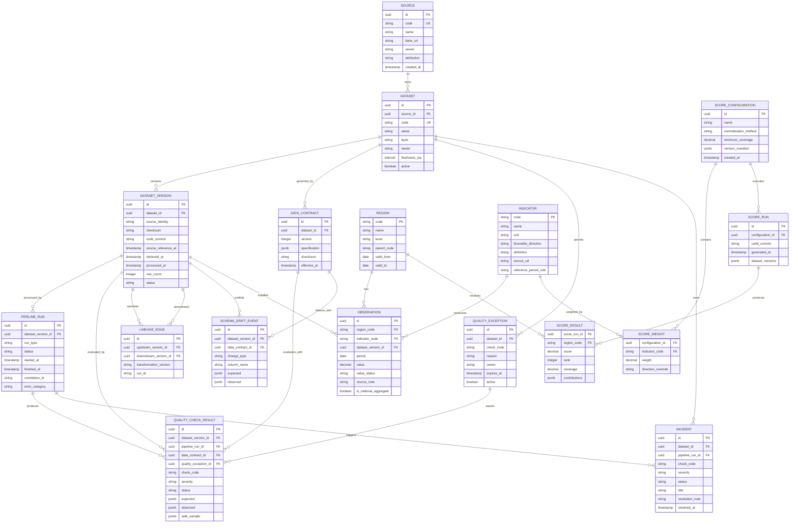

# Entity Relationship Diagram

- Status: Phase 3 logical and physical model
- Updated: 2026-08-11

## Schema placement

| Entity group | PostgreSQL schema |
|---|---|
| Source, Dataset, DatasetVersion, PipelineRun, Contract, Checks, Exceptions, Drift, Incidents, Lineage | `ops` |
| Unchanged BPS response payload | `bronze` |
| Region, Indicator, normalized Observation | `silver` |
| Scoring configuration, score run/results, coverage marts | `gold` |

## Modeling notes

- `source_reference_at`, `retrieved_at`, and `processed_at` are separate concepts.
- Province codes must be stored as strings to preserve leading zeroes and code semantics.
- National aggregate is retained but excluded from province ranking.
- Provisional, revised, unavailable, zero, and missing values must remain distinguishable through `value_status` and notes.
- `ScoreRun` freezes dataset versions and code commit so results can be reproduced.
- Every quality result points to the exact contract version used by its pipeline run.
- Exceptions are time-bounded and auditable; incident resolution never rewrites check history.
